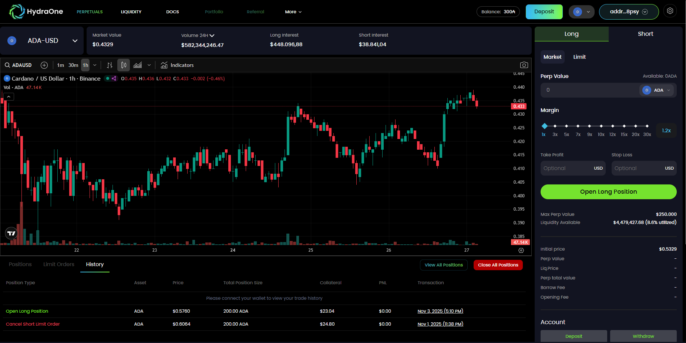
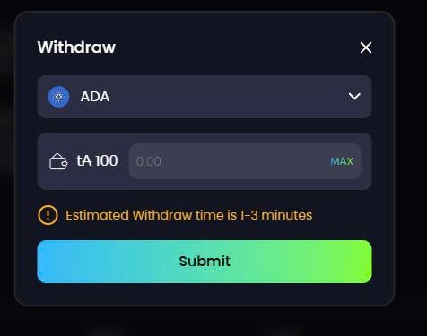
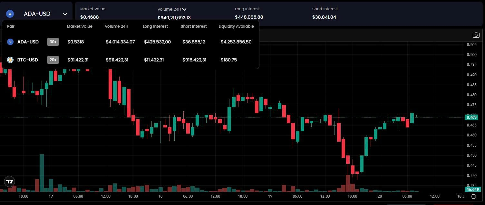
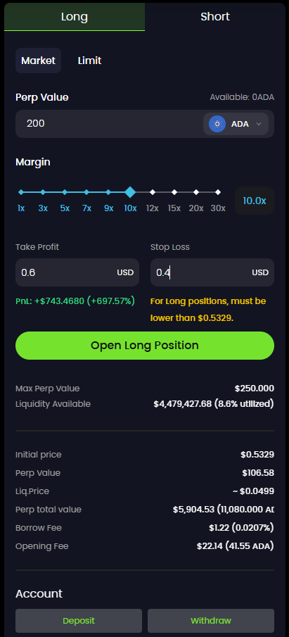
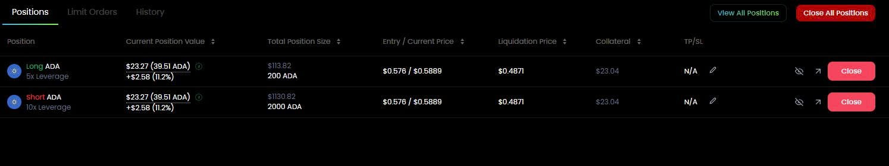
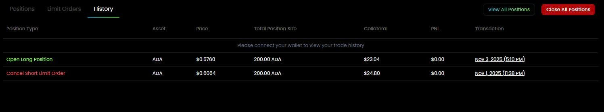
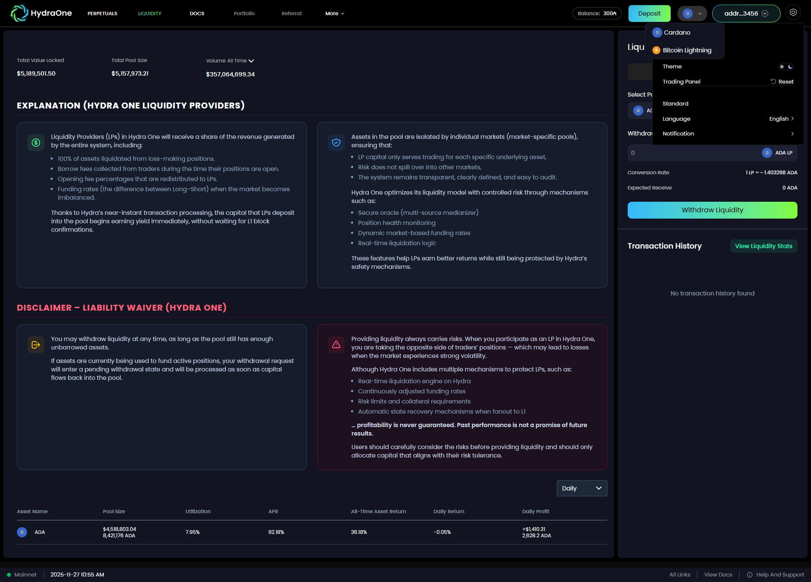

# UI Screenshots & Feature Showcase

# 1. Document Purpose

This document presents the **main UI screens** of Hydra One to clearly demonstrate:

* Real user experience
* Trading and liquidity workflows
* Core system features

Images will be added manually by the development team following the structure below.

---

# 2. **Home / Dashboard Screen**

**Purpose:**

* Provide an overview of the market and popular trading pairs.
* Display pool statistics, funding rates, and trading volume.

  

 

---

 

# 3. **Wallet Connect Screen**

**Purpose:** Allow users to connect their wallets (Nami / Eternl / Lace) or log in with email to perform transactions.

 

 

 

 

# 4. **Perpetual Trading Screen**

## 4.1 Price Chart & Pair Selection

**Description:**

* Candlestick charts (1m / 5m / 1h / 4h / 1D)
* List of trading pairs (ADA/USD, BTC/USD, etc.)

 

---

## 4.2 Open Position Form (Long / Short)

**Purpose:** The trader enters parameters to open a position.

**Form details:**

* Select: Long / Short — Market / Limit
* Enter Perp Value
* Choose margin
* Enter Take Profit
* Enter Stop Loss
* Estimated total cost
* Expected Entry Price
* Expected Liquidation Price

 

 

---

---

# 5. **Positions Management Screen**

**Detailed description:**

* List of open positions
* Entry Price / Mark Price
* Collateral
* Leverage
* Real-time PnL
* Funding Fee
* Applied TP/SL
* "Close Position" button
* "Edit TP/SL" button

 

---

# 6. **Close Position Screen**

 

---

# 7. **Order History Screen**

**Detailed description:**

* List of open/close orders
* Automatic TP/SL orders
* Liquidated orders
* Status: success / pending / failed
* Timestamp
* Order value

 

---

# 8. **Liquidity Screen**

## 8.1 LP Overview Screen

**Description:**

* Total liquidity
* Estimated yield
* Allocation by trading pair

 

---

## 8.2 Add Liquidity Form

**Description:**

* Enter ADA / token amount
* View allocation ratio
* Estimate minted LP Tokens

 

---

## 8.3 Withdraw Liquidity Form

**Description:**

* Enter the amount of LP Tokens to withdraw
* System calculates returned amount

 