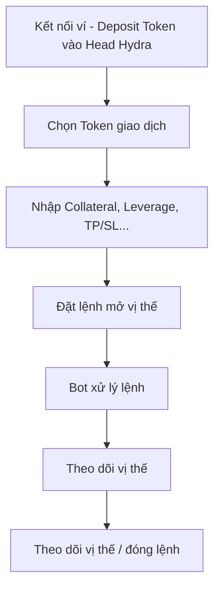
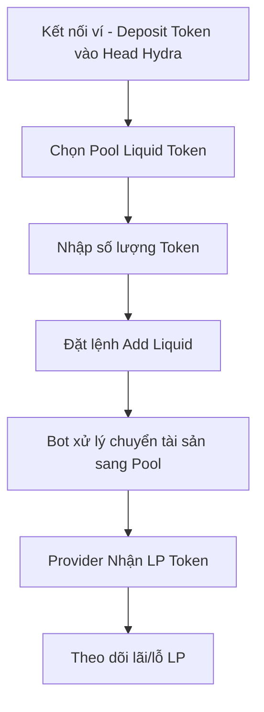
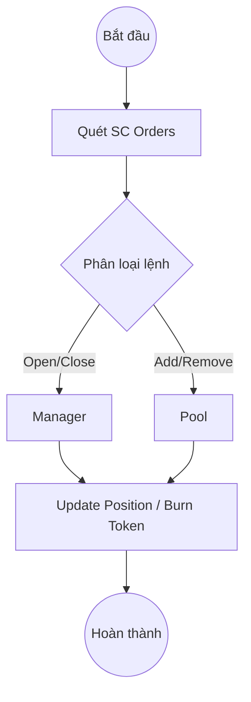

# BUSINESS REQUIREMENT DOCUMENT (BRD)

---

## **1. Giới thiệu**

### 1.1 Mục tiêu tài liệu

Tài liệu này xác định **mục tiêu kinh doanh, yêu cầu nghiệp vụ, các ràng buộc và phạm vi của dự án Hydra One**, nhằm tạo cơ sở cho việc:

* Xây dựng đặc tả chức năng và thiết kế kỹ thuật (SDD).
* Đảm bảo mọi yêu cầu của người dùng và tổ chức được phản ánh chính xác.
* Làm căn cứ kiểm thử và đánh giá thành công của dự án.

### 1.2 Phạm vi áp dụng

Hydra One là **sàn giao dịch phái sinh phi tập trung (Perpetual DEX)** hoạt động trên **Hydra Layer-2** của Cardano, cho phép:

* Người dùng giao dịch Long/Short tài sản bằng đòn bẩy.
* Cung cấp và rút thanh khoản thông qua Liquid Pool.
* Quản lý vị thế, đóng tự động, thanh lý và tính funding.

---

## **2. Mục tiêu kinh doanh**

| ID | Mục tiêu | Kết quả mong đợi | Chỉ số đo lường (KPI) |
|----|----|----|----|
| OB-01 | Tạo ra sàn Perp đầu tiên hoạt động ổn định trên Hydra | Ứng dụng Hydra Head thực tế | ≥100 TPS |
| OB-02 | Giảm phí giao dịch xuống gần 0 | Thực hiện giao dịch Layer-2 micro-fee | <0.01 ADA/tx |
| OB-03 | Tăng trải nghiệm trader, Provider realtime | Xử lý lệnh <1 giây | Tỷ lệ thành công ≥99% |
| OB-04 | Đảm bảo minh bạch, phi tập trung, độ trễ thấp | Mọi vị thế lưu on-chain | 100% traceable |
| OB-05 | Xây dựng SDK mở cho developer | Cho phép tái sử dụng Hydra SDK | ≥2 tích hợp ngoài |

---

## **3. Phân tích tình huống hiện tại**

### 3.1 Hệ sinh thái DeFi Cardano hiện nay

* Chủ yếu tập trung vào AMM DEX (Minswap, SundaeSwap).
* Thiếu sản phẩm **Perpetual Futures** – mảng có volume cao nhất trên các chain khác (GMX, dYdX, Aster, HyperLiquid).
* Các dự án hiện tại hoạt động hoàn toàn trên Layer-1 nên gặp hạn chế về tốc độ và phí.

### 3.2 Cơ hội thị trường

* Hydra giúp **Cardano đạt hiệu năng tương đương CEX**.
* Việc triển khai Hydra One sẽ tạo **use case thực tế đầu tiên cho Hydra**, tăng adoption và khẳng định năng lực công nghệ của Cardano trong mảng phái sinh.

---

## **4. Các bên liên quan (Stakeholders)**

| Vai trò | Mô tả | Trách nhiệm |
|----|----|----|
| **PM / Product Owner** | Quản lý dự án, định hướng sản phẩm | Định nghĩa yêu cầu, phê duyệt phạm vi |
| **Business Analyst (BA)** | Phân tích nghiệp vụ, xác định yêu cầu | Viết BRD, BPF, Use Case |
| **Smart Contract Dev** | Xây dựng các hợp đồng Orders / Manager / Pool | Phát triển & kiểm thử logic |
| **Bot Developer** | Xây dựng dịch vụ Bot xử lý lệnh | Tự động hóa giao dịch |
| **Frontend Dev** | Thiết kế & xây dựng giao diện web | Tích hợp ví, hiển thị dữ liệu |
| **Tester / QA** | Kiểm thử hệ thống | Đảm bảo chất lượng |
| **Liquidity Provider (LP)** | Cung cấp vốn cho Pool | Nhận phần thưởng LP Token |
| **Trader** | Giao dịch Long/Short | Tăng volume, tạo tính thanh khoản |

---

## **5. Phạm vi dự án (Project Scope)**

### 5.1 Trong phạm vi (In-Scope)

| Mục | Mô tả |
|----|----|
| Giao dịch Perpetual Long/Short | Hỗ trợ lệnh Market và Limit |
| Liquidity Pool | Cho phép Add / Withdraw Liquidity |
| Position Management | Quản lý, cập nhật và đóng vị thế |
| Bot System | Quét, xử lý, thanh lý và funding |
| Giao diện Web (DApp) | Tích hợp ví Nami/Eternl, realtime data |
| Hydra SDK Integration | Xử lý giao dịch Layer-2 tốc độ cao |

### 5.2 Ngoài phạm vi (Out-of-Scope)

| Mục | Mô tả |
|----|----|
| Cross-chain bridge | Không bao gồm cầu nối tài sản sang L1 khác |
| Mobile App | Phiên bản di động chưa nằm trong giai đoạn này |
| Perpetual Options | Không triển khai hợp đồng quyền chọn trong MVP |
| Token Launch | Không phát hành token riêng giai đoạn đầu |

---

## **6. Yêu cầu nghiệp vụ (Business Requirements)**

| ID | Mô tả yêu cầu | Ưu tiên | Ghi chú |
|----|----|----|----|
| BR-01 | Người dùng có thể kết nối ví (Nami, Eternl) hoặc tạo ví mới | Cao | UI hỗ trợ CIP-30 |
| BR-02 | Trader mở vị thế Long/Short với lệnh Market hoặc Limit | Cao | Tạo UTxO trên Orders SC |
| BR-03 | Bot đọc và xử lý các yêu cầu mở/đóng | Cao | Xử lý theo FIFO |
| BR-04 | Hệ thống quản lý vị thế và cập nhật PnL realtime | Cao | Dữ liệu Manager SC |
| BR-05 | Funding fee được cập nhật mỗi giờ | Trung bình | Sử dụng Oracle |
| BR-06 | Provider thêm / rút thanh khoản từ Pool | Cao | Mint/Burn LP Token |
| BR-07 | Hệ thống tự động thanh lý vị thế vượt ngưỡng | Cao | Dựa trên Liquidation Price |
| BR-08 | Giao diện hiển thị số dư, PnL, funding | Trung bình | Dữ liệu từ SC qua API |
| BR-09 | Audit dữ liệu vị thế công khai | Trung bình | On-chain Explorer |
| BR-10 | SDK mở cho dev ngoài | Thấp | API + Hydra SDK Doc |

---

## **7. Yêu cầu phi chức năng (Non-Functional Requirements)**

| ID | Danh mục | Yêu cầu |
|----|----|----|
| NFR-01 | Hiệu năng | Giao dịch khớp trong <1s |
| NFR-02 | Bảo mật | Smart Contract kiểm toán độc lập |
| NFR-03 | Khả năng mở rộng | Hỗ trợ 1000+ vị thế đồng thời |
| NFR-04 | Khả năng khôi phục | Bot xử lý lỗi và re-submit TX |
| NFR-05 | Trải nghiệm người dùng | Giao diện thân thiện, realtime |
| NFR-06 | Khả năng quan sát | Hệ thống log mọi TX để audit |
| NFR-07 | Tương thích | Chuẩn CIP-30, CIP-68 (Datum/Asset) |

---

## **8. Phân tích người dùng (User Persona)**

| Persona | Mục tiêu | Hành vi | Nhu cầu |
|----|----|----|----|
| **Trader chuyên nghiệp** | Tìm kiếm nền tảng perp phí thấp, tốc độ cao, an toàn và phi tập chung | Giao dịch nhiều lần/ngày, sử dụng đòn bẩy cao | Giao dịch nhanh, an toàn, minh bạch |
| **Provider (LP)** | Kiếm lợi nhuận thụ động từ cung cấp vốn | Gửi/rút thanh khoản | Giao diện rõ ràng, thông tin lãi/lỗ minh bạch |
| **Developer tích hợp** | Muốn kết nối Hydra SDK để xây DApp Layer-2 | Gọi API và test Hydra Head | Tài liệu SDK chi tiết |

---

## **9. Quy trình nghiệp vụ (Business Process Overview)**

### 9.1 Trader Flow

### 9.2 Provider Flow

### 9.3 Bot Flow

---

## **10. Ràng buộc và giả định**

| Loại | Nội dung |
|----|----|
| **Ràng buộc kỹ thuật** | Phụ thuộc vào Hydra Node, Aiken, HydraSDK |
| **Ràng buộc pháp lý** | Sản phẩm chỉ dành cho người dùng DeFi không chịu quản lý CEX |
| **Giả định** | Giá Oracle tin cậy, mạng Hydra ổn định, phí L1 thấp |

---

## **11. Tiêu chí thành công (Success Criteria)**

| Tiêu chí | Mô tả |
|----|----|
| ≥500 người dùng testnet trong 3 tháng đầu | Đạt adoption cộng đồng |
| 99% giao dịch xử lý thành công qua Hydra | Đảm bảo ổn định kỹ thuật |
| TVL đạt ≥100,000 ADA trong Pool | Thành công giai đoạn khởi chạy |
| SDK được 1 dự án khác tích hợp | Mở rộng hệ sinh thái Hydra |

---

## **12. Kết luận**

Tài liệu BRD này định hình **toàn bộ yêu cầu kinh doanh và nghiệp vụ cốt lõi của Hydra One**. Nó là nền tảng để:

* Thiết kế kỹ thuật chi tiết (System Design Document).
* Phát triển và kiểm thử sản phẩm thống nhất mục tiêu.
* Đảm bảo sản phẩm đạt đúng **giá trị, tốc độ và tính phi tập trung** mà Hydra hướng đến.

> **Hydra One – Giao dịch tức thì, minh bạch, an toàn, và phi tập trung.**