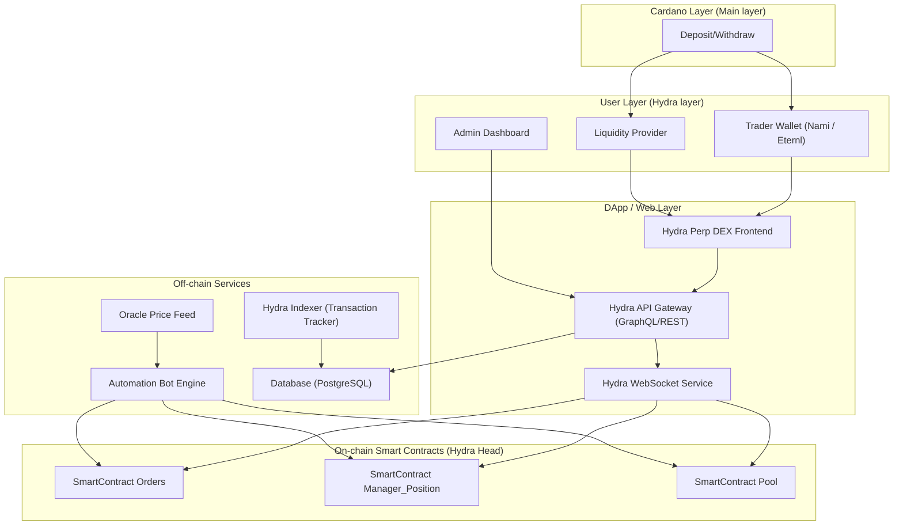
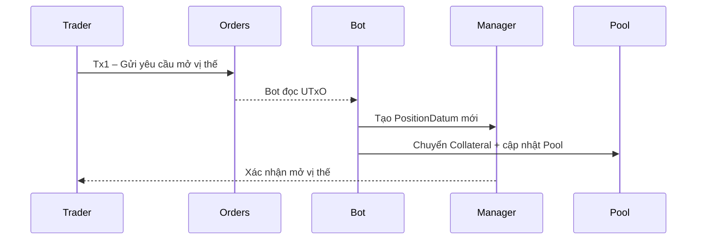

# Software Requirements Specification (SRS)

## 1. **Giới thiệu**

### 1.1 Mục tiêu tài liệu

Tài liệu SRS này mô tả chi tiết **các yêu cầu phần mềm** của dự án Hydra One – sàn giao dịch phái sinh phi tập trung hoạt động trên **Hydra Layer-2 của Cardano**.

Nó được sử dụng bởi:

* Nhà đầu tư & đối tác (hiểu rõ mô hình sản phẩm & tiềm năng thị trường).
* Đội phát triển kỹ thuật (tham chiếu cho thiết kế, lập trình, và test).
* Nhóm vận hành & QA (xác minh tính hoàn chỉnh và đúng yêu cầu).


---

### 1.2 Phạm vi dự án

**Hydra One** là sàn **giao dịch hợp đồng Perpetual (vô thời hạn)** chạy trên Layer-2 Hydra nhằm:

* **Tăng tốc độ giao dịch lên <1 giây.**
* **Giảm phí gần bằng 0.**
* Cung cấp trải nghiệm **giao dịch, thanh khoản và quản lý vị thế** hoàn toàn phi tập trung.

Sản phẩm bao gồm:

* Hệ thống **Smart Contract** (Orders, Manager, Pool).
* **Bot Engine** xử lý tự động.
* **Oracle Service** cung cấp giá thị trường.
* **Hydra Head Nodes** để xử lý giao dịch L2.
* Giao diện **Web DApp + API Gateway** phục vụ Trader và Liquidity Provider.


---

### 1.3 Định nghĩa, từ viết tắt

| Thuật ngữ | Giải nghĩa |
|----|----|
| **Perp / Perpetual** | Hợp đồng phái sinh không có ngày đáo hạn. |
| **Hydra** | Giải pháp Layer-2 mở rộng cho Cardano, xử lý giao dịch off-chain. |
| **SC (Smart Contract)** | Mã logic on-chain xử lý lệnh, thanh khoản, vị thế. |
| **Bot Engine** | Dịch vụ off-chain tự động tạo và ký Tx2. |
| **Oracle** | Nguồn dữ liệu giá thị trường (ADA/USD, BTC/USD, v.v.) |
| **LP** | Liquidity Provider – người cung cấp thanh khoản. |
| **PnL** | Profit & Loss – Lãi và lỗ của vị thế. |


---

## 2. **Tổng quan hệ thống**

### 2.1 Mục tiêu chính

* Tạo **nền tảng giao dịch phái sinh phi tập trung nhanh nhất** trên Cardano.
* Cắt giảm **100% phí mạng L1**, loại bỏ batcher.
* Đem đến **trải nghiệm tương đương CEX (nhanh, realtime)** nhưng vẫn phi tập trung.


---

### 2.2 Mô hình kiến trúc tổng thể




---

## 3. **Các yêu cầu chức năng (Functional Requirements)**

### FR-01. Mở vị thế (Open Position)

**Mô tả:** Trader tạo lệnh mở vị thế Long hoặc Short với mức đòn bẩy, TP/SL tùy chọn.

**Quy trình:**


1. Trader tạo **Tx1** gửi đến Smart Contract Orders (lưu UTxO + datum).
2. Bot đọc yêu cầu → tạo **Tx2** mở vị thế trên Manager Position.
3. Chuyển collateral vào Pool → ghi nhận vị thế mới.

**Kết quả:**

* Một `PositionDatum` mới được tạo.
* Trader nhận thông báo mở vị thế thành công.


---

### FR-02. Đóng vị thế (Close Position)

**Mô tả:** Trader yêu cầu đóng vị thế hiện có.

**Quy trình:**


1. Tx1 – Trader gửi yêu cầu đóng vị thế.
2. Tx2 – Bot burn token vị thế, chuyển tiền (gốc + PnL) về ví Trader.

**Điều kiện:**

* Chỉ đóng khi trạng thái `Opened`.
* Bot xác thực chữ ký hợp lệ.


---

### FR-03. Tự động đóng vị thế (Take Profit / Stop Loss)

**Mô tả:** Bot theo dõi giá Oracle và tự động đóng vị thế đạt TP/SL.

**Tần suất:** 2 giây / lần kiểm tra.

**Kết quả:**

* Bot tạo lệnh đóng → burn token → chuyển tiền → cập nhật pool.


---

### FR-04. Thanh lý (Liquidation)

**Mô tả:** Khi giá giảm tới ngưỡng thanh lý, Bot tự động đóng vị thế và thu hồi collateral còn lại.

**Kết quả:**

* Vị thế chuyển sang trạng thái `Liquidated`.
* Pool cập nhật dữ liệu mới.


---

### FR-05. Thêm / Rút thanh khoản (LP)

**Mô tả:**

* LP gửi yêu cầu Add/Withdraw Liquidity (Tx1).
* Bot thực hiện Add/Withdraw (Tx2), mint/burn LP Token.

**Kết quả:**
* Cập nhật tổng thanh khoản (`total_liquidity`).
* Cập nhật danh mục LP của từng người.


---

### FR-06. Cập nhật phí vay theo giờ

**Mô tả:** Bot hệ thống sẽ tự động tính toán **phí vay theo giờ (funding rate)** sau mỗi 1 giờ dựa trên tương quan giữa **tổng vị thế Long và Short** đang mở trong hệ thống.

Mục tiêu của funding rate là **giữ cân bằng thị trường**, đảm bảo tổng giá trị Long và Short không chênh lệch quá lớn.

Funding rate được xác định như sau:

* **Khi tỷ lệ Long/Short là 50/50**

→ Phí vay = **một tham số chuẩn (base funding rate)** được thiết lập trước trong Smart Contract (có thể kiểm chứng công khai).
* **Khi tỷ lệ Long/Short lệch khỏi 50/50**

→ Phí vay sẽ **tăng hoặc giảm** tương ứng với mức độ lệch.

→ Bên đang đông hơn sẽ phải trả phí cao hơn.

Smart Contract sẽ ghi nhận funding rate mới vào PoolDatum và sử dụng để cập nhật PnL của từng vị thế.

### **Công thức tổng quát (dạng dễ hiểu)**

`funding_rate = base_rate × (LongOpenInterest - ShortOpenInterest) / TotalOpenInterest `

Trong đó:

* `base_rate`: phí vay chuẩn khi thị trường cân bằng 50/50 được định nghĩa trong SC
* `OpenInterest`: tổng giá trị các vị thế đang mở


---

### FR-07. Giao diện Web DApp

* Kết nối ví (Nami, Eternl) - Tạo ví mới.
* Hiển thị biểu đồ giá, danh sách cặp giao dịch.
* Form Open/Close position
* Quản lý vị thế, TP/SL, PnL realtime.
* Form Add/WithDraw LP
* Bảng thanh khoản LP, Funding, APY.


---

## 4. **Các yêu cầu phi chức năng (Non-Functional Requirements)**

| Mã | Danh mục | Mô tả | Mục tiêu |
|----|----|----|----|
| NFR-01 | Hiệu năng | Thời gian xử lý giao dịch | < 1s / Tx |
| NFR-02 | Bảo mật | Không có khóa riêng tập trung | ✅ |
| NFR-03 | Khả năng mở rộng | 1 Hydra Head ≥ 50 Tx/s | ✅ |
| NFR-04 | Tính khả dụng | Hệ thống online 99.9% | ✅ |
| NFR-05 | Minh bạch | Mọi vị thế on-chain / kiểm chứng được | ✅ |
| NFR-06 | Giám sát | Log, metric, alert realtime | ✅ |
| NFR-07 | UX | Thao tác thân thiện, realtime chart | ✅ |


---

## 5. **Yêu cầu hệ thống**

### 5.1 Thành phần On-Chain

* **SC_Orders:** nhận và lưu trữ yêu cầu Tx1.
* **SC_Manager_Position:** ghi vị thế mở, PnL, TP/SL.
* **SC_Pool:** quản lý thanh khoản, funding rate, LP Token.

### 5.2 Thành phần Off-Chain

* **Bot Engine:** xử lý auto submit transactions, thanh lý, funding, auto TP/SL.
* **Oracle Feed:** lấy dữ liệu giá thị trường.
* **API Gateway:** cung cấp API GraphQL/REST cho UI & Partner.
* **Database (PostgreSQL):** lưu cache, lịch sử, snapshot pool.


---

## 6. **Yêu cầu bảo mật**

* Tất cả các giao dịch đều được xác minh chữ ký ví người dùng.
* Bot chỉ có quyền xử lý các giao dịch pending, không thể rút tiền trực tiếp.
* Mỗi `Tx` đều có nonce, tránh replay.
* Funding và pool được xác minh bởi hàm hash trong datum.
* Audit định kỳ smart contract & server log.


---

## 7. **Cấu trúc dữ liệu chính**

### 7.1 PositionDatum

```markdown

pub type PositionType {
  MarketOrder
  LimitOrder
}

pub type PositionSide {
  Long
  Short
}

pub type PositionDatum {
  owner_pkh: AddressHash,
  owner_stake_key: Option<AddressHash>,
  entered_position_time: POSIXTime,
  entered_at_usd_price: Int,
  stop_loss: Int,
  take_profit: Int,
  position_policy_id: PolicyId,
  manage_positions_script_hash: ScriptHash,
  collateral_asset: Asset,
  maintain_margin_amount: Int,
  hourly_borrow_fee: Int,
  collateral_asset_amount: Int,
  position_asset_amount: Int,
  side: PositionSide,
}
```


### 7.2 PoolDatum

```markdown
pub type PoolDatum {
  underlying_asset: Asset,
  lp_asset: Asset,
  liquidity_total_asset_amount: Int,
  liquidity_total_lp_minted: Int,
  total_lended_amount: Int,
}
```


---

## 8. **Luồng giao dịch tổng thể**




---

## 9. **Yêu cầu kinh tế & phí**

| Loại phí | Perp (L1) | Hydra One (L2) |
|----|----|----|
| Phí mạng | 0.3–0.7 ADA | 0 ADA |
| Phí batcher | 1.5 ADA | 0 ADA |
| Phí nền tảng | 0.35–0.6% hoặc min 2 ADA | Cố định 2 ADA |
| Phí LP | 0.3% | 0.3% |

> → Hydra One tiết kiệm **70–90% chi phí** so với Perp Finance.


---

## 10. **Quản lý yêu cầu & thay đổi**

* Mỗi yêu cầu được gán mã: `FR-XX` hoặc `NFR-XX`.
* Thay đổi được quản lý qua **Change Log**.
* Review định kỳ mỗi Sprint để cập nhật phạm vi kỹ thuật.


---

## 11. **Phụ lục**

* **Ngôn ngữ hợp đồng:** Aiken.
* **Backend:** Python / FastAPI + PostgreSQL.
* **Hydra SDK:** WASM / TypeScript cho API và UI.
* **DevOps:** Docker, CI/CD (GitHub Actions).
* **Monitoring:** Prometheus + Grafana.


---

## 12. **Kết luận**

Hydra One là giải pháp tiên phong **kết hợp hiệu năng Hydra Layer-2 với giao dịch Perpetual**, mang lại:

* **Hiệu suất ngang CEX, minh bạch phi tập trung.**
* **Phí gần như bằng 0, xác nhận tức thì.**
* **Cấu trúc mô-đun mở rộng dễ dàng.**
