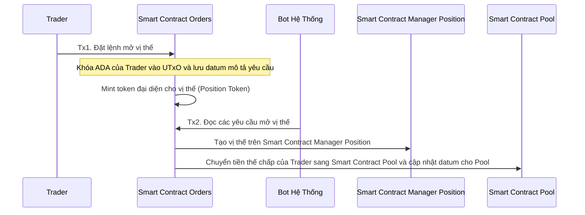
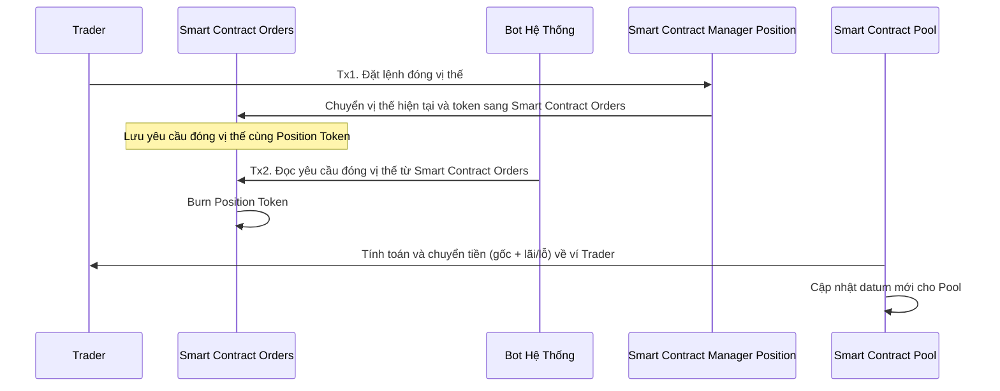
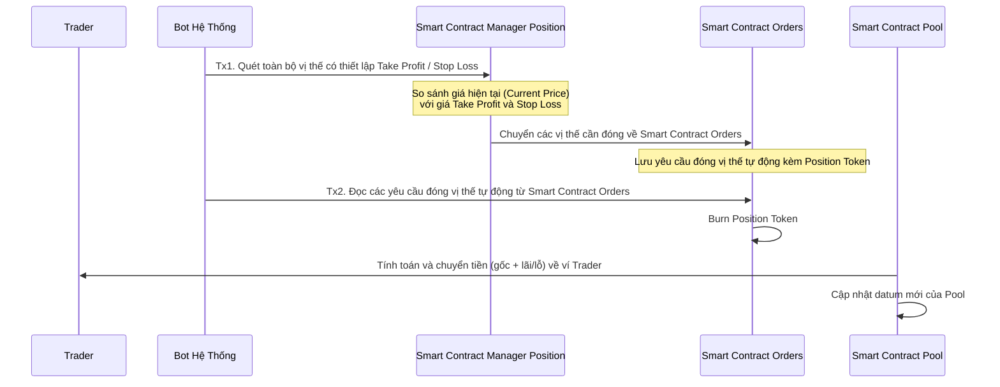
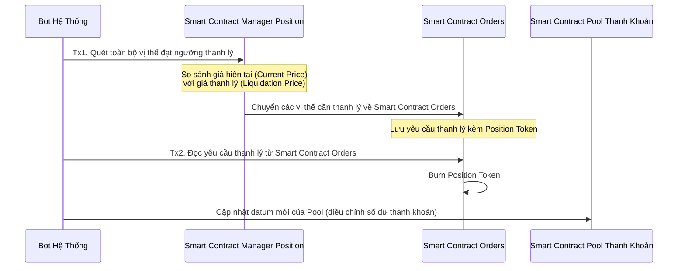
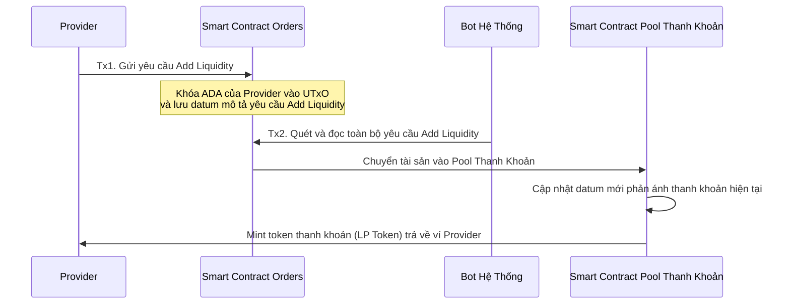
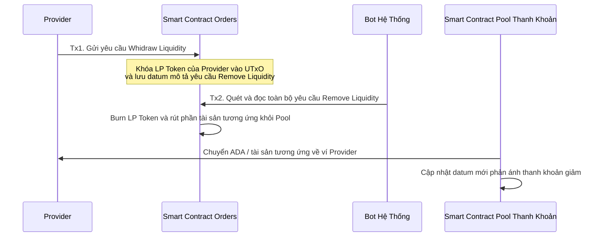

# System Flow Document (SFD)

# 1. Mục tiêu tài liệu

Tài liệu **SFD – System Flow Document** mô tả:

* Toàn bộ luồng giao dịch giữa **Trader – LP – Bot – Smart Contract – Pool**
* Mô tả chi tiết từng bước xử lý nội bộ
* Dựa trên mô hình 2 giao dịch:
  * **Tx1:** User khởi tạo yêu cầu
  * **Tx2:** Bot xử lý và hoàn thành nghiệp vụ
* Cách các Smart Contract tương tác với nhau:
  * **SC Orders** – lưu yêu cầu & khóa tài sản
  * **SC Manager Position** – quản lý vị thế
  * **SC Pool** – quản lý thanh khoản, funding, PnL

Tài liệu này là nền tảng để đội kỹ thuật xây dựng **Smart Contract**, **Bot Engine**, và **Database**.

---

# 2. Các thành phần hệ thống

| Thành phần | Vai trò |
|----|----|
| **Trader** | Mở/đóng vị thế Long/Short |
| **LP – Liquidity Provider** | Cung cấp & rút thanh khoản |
| **Smart Contract Orders** | Nhận yêu cầu, khóa ADA, lưu datum, mint token |
| **Smart Contract Manager Position** | Lưu trạng thái vị thế đang mở |
| **Smart Contract Pool** | Quản lý tài sản, funding, thanh khoản |
| **Bot Hệ thống** | Tự động tạo Tx2 cho mọi nghiệp vụ |
| **Oracle Price Feed** | Cung cấp giá hiện tại để đóng auto/SL/TP hoặc thanh lý |

---

# 3. **Luồng 1 – Trader mở vị thế (Open Position Flow)**

### **Tx1 – Trader tạo yêu cầu**

* Trader gửi giao dịch mở vị thế.
* ADA collateral bị **khóa trong SC Orders**.
* Orders lưu **datum mô tả lệnh**.
* Orders **mint ra Position Token** để định danh lệnh mở này.

### **Tx2 – Bot xử lý yêu cầu**

* Bot quét Orders theo **FIFO**.
* Bot chuyển:\n✔ Position Token → SC Manager Position\n✔ Collateral → SC Pool\n✔ 2.5 ADA (logic SC yêu cầu) → SC Manager Position
* Manager Position tạo **vị thế mới**.
* Pool cập nhật **tổng thanh khoản**.

### **Sequence Diagram**

---

# 4. **Luồng 2 – Trader đóng vị thế (Close Position Flow)**

### **Tx1 – Trader tạo yêu cầu**

* Trader gửi giao dịch đóng.
* Manager chuyển **Position Token + trạng thái vị thế** về Orders.
* Orders lưu yêu cầu trong UTxO.

### **Tx2 – Bot xử lý**

* Bot đọc yêu cầu từ Orders.
* Burn Position Token.
* Tính toán **gốc + lãi/lỗ**.
* Chuyển tiền từ Pool → Trader.
* Pool cập nhật datum mới.

### **Sequence Diagram**

---

# 5. **Luồng 3 – Đóng vị thế tự động (Take Profit / Stop Loss)**

### **Tx1 – Bot phát hiện điều kiện TP/SL**

* Bot đọc Manager Position.
* So sánh Current Price với TP/SL.
* Vị thế đạt điều kiện được chuyển về Orders.

### **Tx2 – Bot xử lý**

* Burn Position Token.
* Chuyển tiền từ Pool → Trader.
* Cập nhật datum Pool.

### **Sequence Diagram**

---

# 6. **Luồng 4 – Thanh lý tài sản (Liquidation Flow)**

### **Tx1 – Bot phát hiện vị thế bị thanh lý**

* So sánh Current Price với Liquidation Price.
* Chuyển vị thế + token về Orders.

### **Tx2 – Bot thực hiện thanh lý**

* Burn token.
* Cập nhật Pool (collateral mất hoặc giảm).
* Kết thúc vị thế.

### **Sequence Diagram**

---

# 7. **Luồng 5 – Provider thêm thanh khoản (Add Liquidity)**

### **Tx1 – LP gửi yêu cầu**

* LP gửi ADA vào Orders.
* Orders lưu datum mô tả yêu cầu.

### **Tx2 – Bot xử lý**

* Bot đọc Orders.
* Chuyển ADA → Pool.
* Pool mint LP Token trả về Provider.

### **Sequence Diagram**

---

# 8. **Luồng 6 – Provider rút thanh khoản (Remove Liquidity)**

### **Tx1 – Provider gửi yêu cầu**

* LP Token bị khóa vào Orders.
* Orders lưu thông tin rút.

### **Tx2 – Bot xử lý**

* Burn LP Token.
* Chuyển ADA tương ứng về Provider.
* Pool cập nhật datum.

### **Sequence Diagram**

---

# 9. **Tổng kết về kiến trúc xử lý**

| Loại nghiệp vụ | Tx1 bởi User | Tx2 bởi Bot | Token liên quan | Pool thay đổi? |
|----|----|----|----|----|
| Mở vị thế | Trader | Bot | Position Token (mint) | Có |
| Đóng vị thế | Trader | Bot | Position Token (burn) | Có |
| Auto TP/SL | Bot | Bot | Position Token (burn) | Có |
| Thanh lý | Bot | Bot | Position Token (burn) | Có |
| Add Liquidity | Provider | Bot | LP Token (mint) | Có |
| Remove Liquidity | Provider | Bot | LP Token (burn) | Có |