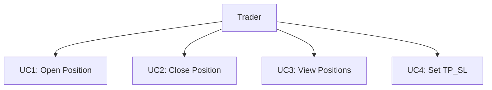
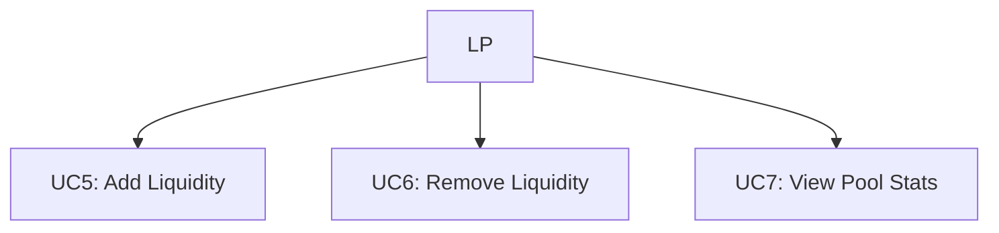
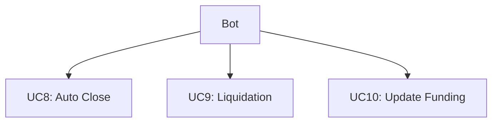
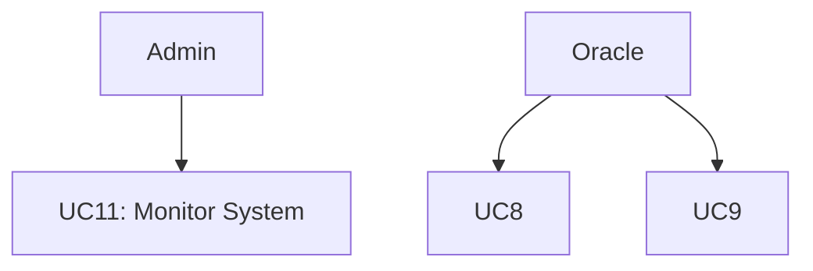
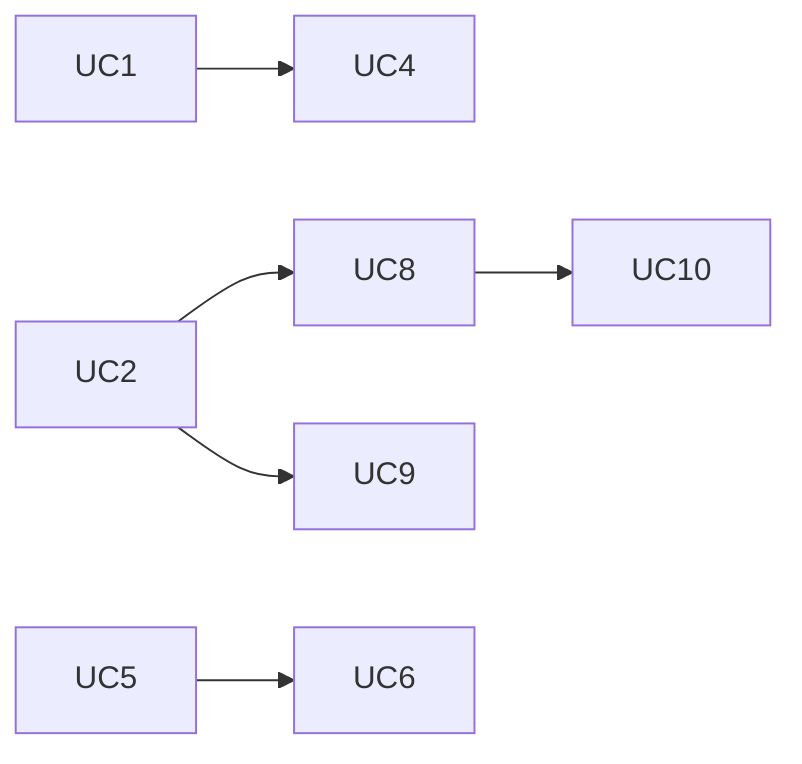
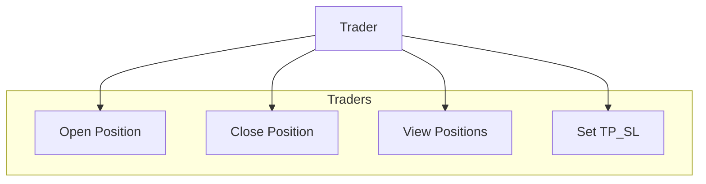
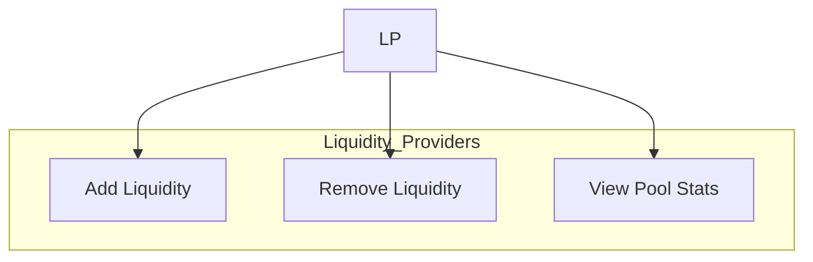
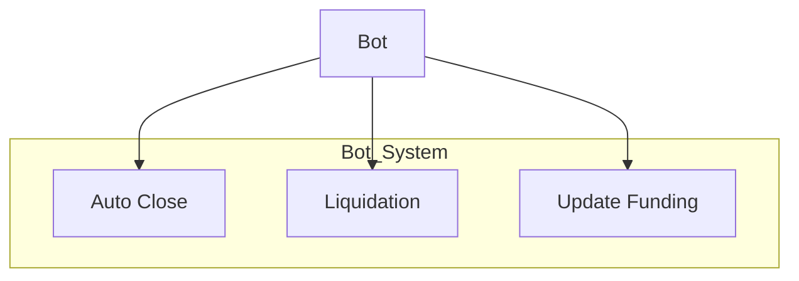
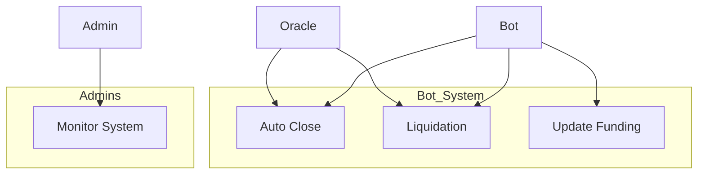

# User Case

# **Tài liệu Use Case Diagram & Specification (UC)**

**Người biên soạn:** NhanTD **Phiên bản:** 1.1 **Ngày cập nhật:** \[05/11/2025\]

---

## 1. Mục tiêu tài liệu

Tài liệu xác định các **Use Case** mà hệ thống Hydra Perp DEX cung cấp, ai là người sử dụng, và cách họ tương tác. Đây là nền tảng để phát triển **System Design**, **UI/UX**, và **Test Plan**.

---

## 2. Tác nhân (Actors)

| Actor | Vai trò | Quyền hạn |
|----|----|----|
| Trader | Người dùng giao dịch | Tạo và quản lý vị thế cá nhân |
| Liquidity Provider (LP) | Nhà đầu tư cung cấp thanh khoản | Add / Remove liquidity |
| Bot System | Tác nhân tự động | Xử lý TP / SL / Funding / Liquidation |
| Smart Contracts | Hợp đồng on-chain (Orders, Manager, Pool) | Thực thi logic giao dịch |
| Oracle Feed | Nguồn giá | Cung cấp dữ liệu giá cho Bot |
| Admin | Quản trị hệ thống | Giám sát pool và tham số kỹ thuật |

---

## 3. Biểu đồ Use Case tổng thể

---

## 4. Danh sách Use Case chi tiết

| ID | Tên Use Case | Actor chính | Mục tiêu | Mô tả ngắn gọn | Kết quả thành công | Kết quả thất bại |
|----|----|----|----|----|----|----|
| **UC1** | Open Position | Trader | Mở vị thế Long/Short | Trader gửi Tx1 tạo UTxO tại SC Orders, Bot xử lý Tx2 mở vị thế | Vị thế được lưu trên SC Manager | Không đủ thanh khoản / lỗi datum |
| **UC2** | Close Position | Trader | Đóng vị thế đang mở | Trader gửi Tx1 đóng vị thế, Bot xử lý Tx2 trả tiền về ví | Vị thế đóng và cập nhật Pool | Lỗi giá hoặc Bot chưa xử lý |
| **UC3** | View Positions | Trader | Xem vị thế đang mở | UI đọc datum SC Manager / Pool | Thông tin hiển thị chính xác | Không tìm thấy dữ liệu |
| **UC4** | Set TP_SL | Trader | Cập nhật TP / SL | Trader gửi Tx cập nhật datum vị thế | TP/SL được lưu và Bot theo dõi | Lỗi datum hoặc giá trị không hợp lệ |
| **UC5** | Add Liquidity | LP | Thêm tài sản vào Pool | LP gửi Tx1 Orders, Bot xử lý Tx2 vào Pool và mint LQ | Nhận token thanh khoản | Sai định dạng lệnh hoặc hết slot |
| **UC6** | Remove Liquidity | LP | Rút tài sản khỏi Pool | LP gửi Tx1 kèm LQ token, Bot burn LQ và trả tài sản | Nhận lại tài sản + lãi | Không đủ thanh khoản hoặc lỗi SC |
| **UC7** | View Pool Stats | LP | Xem thông tin Pool | UI đọc datum SC Pool | Hiển thị volume, APR | Pool chưa đồng bộ |
| **UC8** | Auto Close | Bot System | Đóng tự động theo TP/SL | Bot đọc giá Oracle, tạo Tx2 đóng vị thế | Lệnh TP/SL khớp thành công | Sai giá hoặc lỗi Bot |
| **UC9** | Liquidation | Bot System | Thanh lý vị thế | Bot quét vị thế dưới ngưỡng, burn token, cập nhật Pool | Pool bảo toàn vốn | Lỗi tính toán hoặc funding |
| **UC10** | Update Fee | Bot System | Cập nhật fee | Bot update fee | Fee cập nhật chính xác | Ghi sai hoặc timeout |
| **UC11** | Monitor System | Admin | Theo dõi Pool và Bot | Admin truy cập dashboard giám sát | Báo cáo đầy đủ, logs chính xác | Lỗi API hoặc không đồng bộ |

---

## 5. Quan hệ Use Case (Include / Extend)

> *UC8 (Auto Close) và UC9 (Liquidation) là phần mở rộng của UC2 (Close Position). UC10 (Funding) hỗ trợ tự động cho Bot.*

---

## 6. Mối liên hệ Actor ↔ Use Case

---

## 7. Kết luận

* Bộ Use Case xác định **11 chức năng chính** cho Hydra Perp DEX.
* Hệ thống phân tách rõ vai trò giữa **Trader / LP / Bot / Admin / Oracle**.
* Các Use Case được mô-đun hóa để dễ dàng ánh xạ sang **Smart Contracts** và **API endpoints** trong SDD.
* Là nền tảng cho **User Flow, UI wireframe, test scenarios, và milestone planning**.